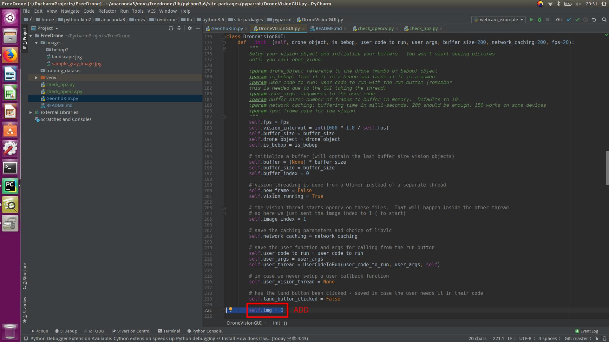
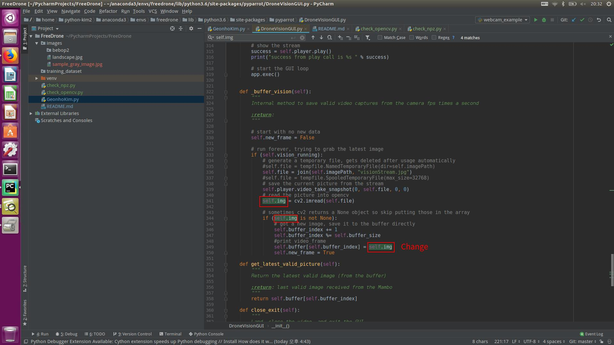

# FreeDrone
Postech Pirl Intern Project team 3

현재 8키의 제어 키입력에 따라 사진과 라벨 데이터가 저장됨

코드를 돌리기 위해선 pyparrot 패키지의 코드를 일부 수정해야 한다.

수정은 스크린 샷 속 빨간상자와 같다.

pyparrot 패키지속 DroneVisionGUI 클래스에 멤버 변수를 추가하고 수정한다.  

